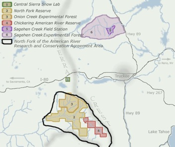

## GENERAL FIELD STATION LINKS

[Natural Reserve System (NRS)](https://ucnrs.org/):  University of California’s network of field stations and reserves 

[UC Berkeley Field Stations](https://fieldstations.berkeley.edu/):  The field stations, research reserves and experimental forests managed by UC Berkeley

[Organization of Biological Field Stations](https://obfst.memberclicks.net/):  

[AmeriFlux network](https://ameriflux.lbl.gov/):  community of sites and scientists measuring carbon, water and energy fluxes across Americas 

## SAGEHEN CREEK FIELD STATION
### Station Director:  [Dr. Ash Zemenick](http://www.ashzemenick.com/).  

[Sagehen Creek Field Station](https://sagehen.ucnrs.org/):  Main Website

[Sagehen Creek Facebook Site](https://www.facebook.com/sagehen.creek/)

[Office of Vice Chancellor for Research (VCR)](https://vcresearch.berkeley.edu/research-unit/sagehen-creek-field-station): UCB VCR site on Sagehen Creek field station

[Sagehen Experimental Forest](https://www.fs.fed.us/psw/ef/sagehen/):  USDA Forest Service’s Pacific Southwest Research Station

[Sagehen Blog till 2021](http://sagehen.blogspot.com/)

## CENTRAL SIERRA SNOW LAB

### Station Manager:  Dr. Andrew Schwartz 

[Central Sierra Snow Lab](https://cssl.berkeley.edu/): Main Website, with Updated Snow Information

[WRCC Weather Station at Snow Lab](https://wrcc.dri.edu/weather/cssl.html): maintained by DRI

[VCR Office page on Central Sierra Snow Lab](https://vcresearch.berkeley.edu/research-unit/central-sierra-snow-lab)

## CHICKERING AMERICAN RIVER RESERVE
[VCR Office page on Chickering American River Reserve](https://vcresearch.berkeley.edu/research-unit/chickering-american-river-reserve):
This is a long-term conservation easement with no research facilities on site.  Seasonal day use.

## ONION CREEK EXPERIMENTAL FOREST
[USFS Pacific Southwest Research Station site](https://www.fs.fed.us/psw/ef/onion_creek/)

## NORTH FORK ASSOCIATION LANDS

[iNaturalist site](https://www.inaturalist.org/places/north-fork-american-river-ca-us)

Currently, access to the North Fork Association Lands are very limited.

